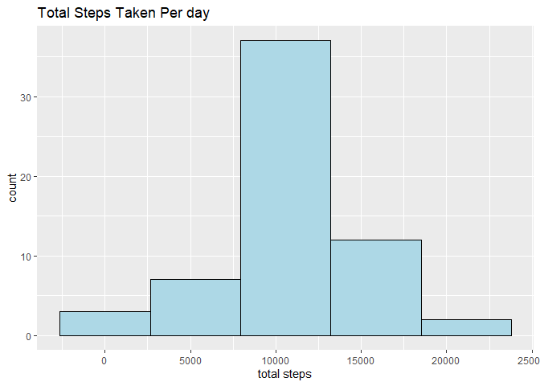

## Loading and preprocessing the data

```r
library(dplyr)
library(ggplot2)

if (!file.exists("activity.csv")) {
  data_url <- "https://d396qusza40orc.cloudfront.net/repdata%2Fdata%2Factivity.zip"
  download.file(data_url, "activity.zip")
  data_retrieve_date <- Sys.Date()
  unzip("activity.zip")
}
activity_data <- read.csv("activity.csv", stringsAsFactors = FALSE)
```


## What is mean total number of steps taken per day?
# Creating a table with sum of steps taken each day

```r
activity_data_groupby_date <- group_by(activity_data, date)
activity_data_daily_steps <- summarize(activity_data_groupby_date, "total.steps" = sum(steps))
print(head(activity_data_daily_steps))
```

```
## # A tibble: 6 x 2
##   date       total.steps
##   <chr>            <int>
## 1 2012-10-01          NA
## 2 2012-10-02         126
## 3 2012-10-03       11352
## 4 2012-10-04       12116
## 5 2012-10-05       13294
## 6 2012-10-06       15420
```

# Plotting steps per day

```r
spdhist <- ggplot(activity_data_daily_steps, aes(total.steps))
spdhist + geom_histogram(bins = 5, color = "black", fill = "lightblue", na.rm = TRUE) + labs(title = "Total Steps Taken Per day") + xlab("total steps")
```

<!-- -->

# Calculating the mean and median of the steps taken per day

```r
spd_mean <- mean(activity_data_daily_steps$total.steps, na.rm = TRUE)
spd_median <- median(activity_data_daily_steps$total.steps, na.rm = TRUE)
print(paste("mean:", spd_mean))
```

```
## [1] "mean: 10766.1886792453"
```

```r
print(paste("median:", spd_median))
```

```
## [1] "median: 10765"
```

## What is the average daily activity pattern?
# Creating a table with average steps taken per intervals across all days

```r
activity_data_groupby_interval <- group_by(activity_data, interval)
activity_data_avg_steps_interval <- summarize(activity_data_groupby_interval[complete.cases(activity_data_groupby_interval), ], "average.steps" = mean(steps))
print(head(activity_data_avg_steps_interval))
```

```
## # A tibble: 6 x 2
##   interval average.steps
##      <int>         <dbl>
## 1        0        1.72  
## 2        5        0.340 
## 3       10        0.132 
## 4       15        0.151 
## 5       20        0.0755
## 6       25        2.09
```

# Plotting a time series plot

```r
asiplot <- ggplot(activity_data_avg_steps_interval, aes(interval, average.steps))
asiplot + geom_point() + geom_line(color = "red") + labs(title = "Average Steps Taken Per Intervals") + ylab("steps")
```

<!-- -->

# Calculating the interval with the maximum number of steps

```r
max_steps <- activity_data_avg_steps_interval[which.max(activity_data_avg_steps_interval$average.steps),]
print(max_steps)
```

```
## # A tibble: 1 x 2
##   interval average.steps
##      <int>         <dbl>
## 1      835          206.
```

## Imputing missing values
# Calculating the number of rows with missing values

```r
missing_rows_count <- sum(!complete.cases(activity_data))
print(paste("number of rows with missing data:", missing_rows_count))
```

```
## [1] "number of rows with missing data: 2304"
```

# Filling the missing data rows with average steps per intervals calculated before

```r
complete_activity_data <- activity_data
complete_activity_data$steps <- unlist(apply(complete_activity_data, 1, function(x) {
  if (is.na(x[1])) {
    as.numeric(activity_data_avg_steps_interval[activity_data_avg_steps_interval$interval == as.numeric(x[3]), 2])
  } else {
   as.numeric(x[[1]])
  }
}))
print(head(complete_activity_data))
```

```
##       steps       date interval
## 1 1.7169811 2012-10-01        0
## 2 0.3396226 2012-10-01        5
## 3 0.1320755 2012-10-01       10
## 4 0.1509434 2012-10-01       15
## 5 0.0754717 2012-10-01       20
## 6 2.0943396 2012-10-01       25
```

# Plotting a histogram with complete dataset

```r
complete_activity_data_groupby_date <- group_by(complete_activity_data, date)
complete_activity_data_daily_steps <- summarize(complete_activity_data_groupby_date, "total.steps" = sum(steps))
cdshist <- ggplot(complete_activity_data_daily_steps, aes(total.steps)) 
cdshist + geom_histogram(bins = 5, color = "black", fill = "lightblue", na.rm = TRUE) + labs(title = "Total Steps Taken Per day") + xlab("total steps")
```

<!-- -->

# Plotting the incomplete and complete datasets together to show the difference

```r
cdshist + geom_histogram(bins = 5, color = "black", fill = "lightblue", na.rm = TRUE) + labs(title = "Total Steps Taken Per day") + xlab("total steps") + geom_histogram(data = activity_data_daily_steps, bins = 5, color = "black", fill = "lightgreen", na.rm = TRUE)
```

<!-- -->

# Calculating the mean and median of the steps taken per day in the complete dataset

```r
cds_mean <- mean(complete_activity_data_daily_steps$total.steps, na.rm = TRUE)
cds_median <- median(complete_activity_data_daily_steps$total.steps, na.rm = TRUE)
print(paste("mean:", cds_mean))
```

```
## [1] "mean: 10766.1886792453"
```

```r
print(paste("median:", cds_median))
```

```
## [1] "median: 10766.1886792453"
```

## Are there differences in activity patterns between weekdays and weekends?
# Adding a factor of weekday to the complete activity dateset

```r
weekday <- sapply(complete_activity_data$date, function(x) {
  x = as.Date(x)
  if (weekdays(x) == "Saturday" | weekdays(x) == "Sunday") {
    "Weekend"
  } else {
    "Weekday"
  }
})
complete_activity_data <- cbind(complete_activity_data, "weekday" = weekday)
print(head(complete_activity_data))
```

```
##       steps       date interval weekday
## 1 1.7169811 2012-10-01        0 Weekday
## 2 0.3396226 2012-10-01        5 Weekday
## 3 0.1320755 2012-10-01       10 Weekday
## 4 0.1509434 2012-10-01       15 Weekday
## 5 0.0754717 2012-10-01       20 Weekday
## 6 2.0943396 2012-10-01       25 Weekday
```

# Plotting the panels to compare results based on a weekday or weekend

```r
complete_activity_data_groupby_interval <- group_by(complete_activity_data, interval, weekday)
complete_activity_data_avg_steps_interval <- summarize(complete_activity_data_groupby_interval, "average.steps" = mean(steps))
cwdplot <- ggplot(complete_activity_data_avg_steps_interval, aes(interval, average.steps, color = weekday))
cwdplot + geom_point() + geom_line() + facet_grid(rows = vars(weekday)) + guides(color = FALSE) + ylab("average steps") + labs(title = "Average Steps Taken per Intervals Across Weekdays and Weekends")
```

<!-- -->
